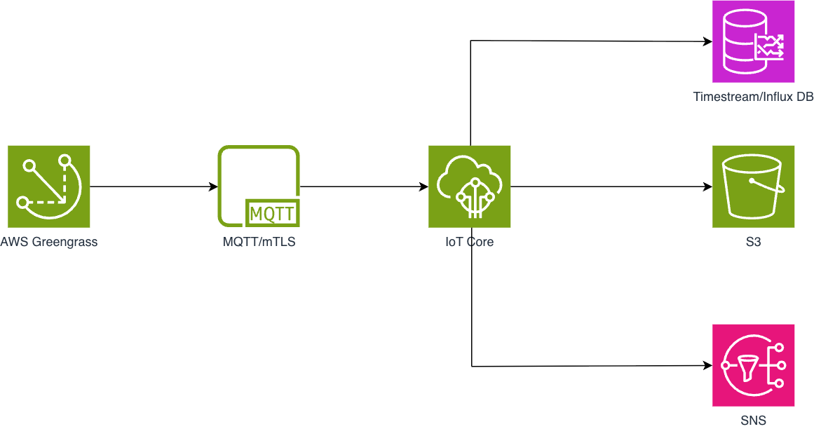

# Telemetry pipeline: multi-tenant robot fleet

## 1. Overview

### 1.1 What is this

A telemetry pipeline that collects sensor data from a fleet of humanoid robots (Unitree G1) deployed across four industrial tenants: Schaeffler, SAP, Siemens, and Bosch. Each robot runs an AWS Greengrass edge agent that publishes motor, IMU, battery, and fault telemetry over MQTT/mTLS to AWS IoT Core. On the cloud side, data goes to InfluxDB for time-series dashboarding, S3 for long-term archival, and SNS for fault alerting. Each tenant gets its own Grafana dashboard filtered to their fleet.

### 1.2 Purpose of this document

This is the design reference for the multi-tenant telemetry pipeline. It covers:

- Functional requirements for edge agents, cloud ingestion, and visualization
- System architecture and component responsibilities
- End-to-end data flow from robot sensor to Grafana dashboard
- Cost, security, and operational considerations

Written for engineers building or extending the pipeline and for stakeholders evaluating the architecture.

### 1.3 Scope note

In scope:

- Robot-to-cloud telemetry ingestion via MQTT/mTLS
- Multi-tenant data isolation at the MQTT topic and certificate level
- Time-series storage (InfluxDB), raw archival (S3), fault alerting (SNS)
- Per-tenant Grafana dashboards with live refresh
- Infrastructure as Code (AWS CDK)
- Demo lifecycle: setup, run, teardown

Out of scope:

- Robot control plane (command/actuator messages from cloud to robot)
- Firmware OTA updates
- ML/AI inference on telemetry streams
- Multi-region or cross-account deployment
- Kinesis, Flink, or Lambda-based stream processing

---

## 2. Acronyms and terminology

| Term | Definition |
|------|-----------|
| MQTT | Message Queuing Telemetry Transport, a lightweight pub/sub protocol for IoT |
| mTLS | Mutual TLS, where both client and server authenticate via certificates |
| X.509 | Standard for public key certificates; used by IoT Core for device authentication |
| IoT Core | AWS managed MQTT broker with device authentication, authorization, and rules engine |
| Greengrass | AWS IoT Greengrass, an edge runtime that runs on the robot, manages local compute and MQTT bridging to IoT Core |
| Rules Engine | IoT Core component that evaluates SQL-like queries on incoming messages and routes them to AWS services |
| InfluxDB | Open-source time-series database; used here via Amazon Timestream for InfluxDB (managed) or self-hosted |
| SNS | Amazon Simple Notification Service, pub/sub for alerts (email, webhook, SMS) |
| QoS | Quality of Service, the MQTT delivery guarantee level (0 = at-most-once, 1 = at-least-once) |
| CDK | AWS Cloud Development Kit, infrastructure as code in TypeScript |
| Tenant | An industrial client (Schaeffler, SAP, Siemens, or Bosch) operating their own robot fleet |
| Edge agent | Greengrass component running on the robot that collects sensor data and publishes MQTT messages |
| Dimension | A metadata tag on a time-series record (e.g., `tenant_id`, `robot_id`) used for filtering and grouping |

---

## 3. Functional requirements

### FR-1: Edge agent (AWS Greengrass)

- Greengrass V2 runs on each robot's onboard compute
- A custom Greengrass component collects sensor data from the robot's hardware interfaces
- Telemetry is batched every 1–5 seconds (configurable) and published over MQTT with QoS 1 (at-least-once)
- Fault events are sent immediately, not batched, to minimize alert latency
- Each robot connects to IoT Core using its tenant's X.509 certificate

### FR-2: MQTT topic structure

| Topic Pattern | Purpose | Publish Frequency |
|---------------|---------|-------------------|
| `dt/{tenant_id}/{robot_id}/telemetry` | Batched sensor telemetry | Every 1–5 seconds |
| `dt/{tenant_id}/{robot_id}/fault` | Fault/alarm events | Immediate on detection |

The `dt` prefix follows the AWS IoT convention for device telemetry topics.

### FR-3: Telemetry signals

#### Motor telemetry

| Field | Type | Unit | Description |
|-------|------|------|-------------|
| `joint_positions[12]` | float array | rad | Angular position of each joint |
| `joint_velocities[12]` | float array | rad/s | Angular velocity of each joint |
| `joint_torques[12]` | float array | Nm | Torque applied at each joint |
| `motor_temps[12]` | float array | °C | Motor winding temperature |

#### IMU / Pose

| Field | Type | Unit | Description |
|-------|------|------|-------------|
| `accel_xyz[3]` | float array | m/s² | Linear acceleration (x, y, z) |
| `gyro_xyz[3]` | float array | rad/s | Angular rate (x, y, z) |
| `orientation_quat[4]` | float array | unitless | Orientation quaternion (w, x, y, z) |

#### Battery / Power

| Field | Type | Unit | Description |
|-------|------|------|-------------|
| `voltage` | float | V | Battery terminal voltage |
| `current` | float | A | Instantaneous current draw |
| `charge_pct` | float | % | State of charge |
| `power_watts` | float | W | Instantaneous power consumption |

#### Fault events

| Field | Type | Values | Description |
|-------|------|--------|-------------|
| `fault_code` | string | `OVERTEMP_JOINT`, `OVERCURRENT`, `JOINT_LIMIT`, `COMMS_TIMEOUT`, `LOW_BATTERY`, `IMU_DRIFT` | Machine-readable fault identifier |
| `fault_severity` | enum | `warn`, `critical` | Severity level |
| `fault_message` | string | — | Human-readable description |

### FR-4: Tenant isolation

- One X.509 certificate per tenant, issued during setup and stored on the robot
- One IoT policy per tenant, scoping `iot:Publish`, `iot:Subscribe`, and `iot:Connect` to that tenant's topic namespace (`dt/{tenant_id}/#`)
- A compromised or misconfigured robot cannot read or write another tenant's data
- IoT Core enforces the policy at the broker level before messages reach the Rules Engine

### FR-5: Rules Engine routing

Three IoT Core rules, defined in CDK:

| Rule | SQL Filter | Action | Target |
|------|-----------|--------|--------|
| Telemetry → InfluxDB | `SELECT * FROM 'dt/+/+/telemetry'` | Write time-series record | InfluxDB database |
| Telemetry → S3 | `SELECT * FROM 'dt/+/+/telemetry'` | Put object | S3 archive bucket |
| Fault → SNS | `SELECT *, topic(2) as tenant_id, topic(3) as robot_id FROM 'dt/+/+/fault'` | Publish notification | SNS fault alerts topic |

Dimensions `tenant_id` and `robot_id` are extracted from the MQTT topic using `topic(2)` and `topic(3)`.

### FR-6: Time-series storage (InfluxDB)

- Database: `robot-sim-telemetry`
- Retention: configurable hot tier and cold tier
- Dimensions: `tenant_id`, `robot_id`
- Measures: multi-measure records per signal group (motor, IMU, battery)
- Grafana connects to it through the native InfluxDB data source plugin

### FR-7: S3 archive

- Bucket: `robot-sim-telemetry-archive-{account}-{region}`
- Object path: `raw/{tenant_id}/{robot_id}/{yyyy}/{MM}/{dd}/{timestamp}-{uuid}.json`
- Public access blocked (`BlockPublicAccess.BLOCK_ALL`)
- No lifecycle rule; the demo teardown deletes the bucket

### FR-8: SNS fault alerts

- Topic: `robot-sim-fault-alerts`
- Payload includes: `tenant_id`, `robot_id`, `fault_code`, `fault_severity`, `fault_message`, `timestamp_ms`
- Subscribers: email addresses (added during setup), optionally webhook endpoints
- One shared topic; subscribers can filter by tenant using SNS filter policies

### FR-9: Grafana dashboards

- Runs as a local Docker container (avoids AWS Managed Grafana SSO setup)
- InfluxDB data source is auto-provisioned on container startup
- Dashboard panels:
  - Motor temperature heatmap / time series
  - Joint position and velocity time series
  - Battery status (voltage, charge %, power)
  - IMU accelerometer readings
  - Fault event log (table)
- Tenant selector: a dashboard variable dropdown that filters all panels by `tenant_id`
- 5-second auto-refresh

---

## 4. High-level system design



### Components

AWS Greengrass (edge): Runs on each robot's onboard compute (Jetson, RPi, or industrial PC). A custom Greengrass component reads sensor buses (CAN, EtherCAT, serial), assembles telemetry payloads, and publishes them to IoT Core over MQTT/mTLS. Greengrass buffers messages locally if connectivity drops and resumes when the connection recovers.

AWS IoT Core (broker): Managed MQTT broker. Authenticates each connection via X.509 mutual TLS. Authorizes publish/subscribe operations against per-tenant IoT policies. Routes all matching messages to the Rules Engine. Scales automatically with no broker sizing or cluster management needed.

IoT Rules Engine (router): Evaluates SQL-like queries against the MQTT topic namespace. Two paths fan out from each message. Telemetry messages (`dt/+/+/telemetry`) go to InfluxDB and S3. Fault messages (`dt/+/+/fault`) go to SNS. Each rule uses an IAM role with least-privilege permissions for its target service.

InfluxDB (hot time-series store): Stores recent telemetry for Grafana queries. Each record carries `tenant_id` and `robot_id` as tags (dimensions), so per-tenant and per-robot filtering is efficient. Retention policies control how long data stays in the hot tier.

Amazon S3 (cold archive): Stores every telemetry message as a raw JSON object, partitioned by tenant, robot, and date. This is the system of record for compliance, replay, and batch analytics. Raw payloads are preserved as-is with no processing applied.

Amazon SNS (fault alerting): Publishes fault events to subscribers: email for operators, webhooks for PagerDuty/Slack integration. The Rules Engine fires and forgets, keeping alerting decoupled from ingestion.

Grafana (visualization): Runs locally via Docker Compose. The InfluxDB data source and dashboards are auto-provisioned on startup. A tenant dropdown variable filters all panels, giving each tenant an isolated view of their fleet. Auto-refresh is set to 5 seconds for live monitoring during demos.

---

## 5. Data flow

These steps trace a single telemetry reading from robot sensor to Grafana chart, matching the architecture diagram above.

1. Sensor sampling: The Greengrass component on the robot reads motor controllers (12 joints), IMU, and battery management system via hardware interfaces.

2. Payload assembly: Readings are assembled into a JSON payload with `timestamp_ms`, `tenant_id`, `robot_id`, and signal groups (`motor`, `imu`, `battery`).

3. Batch publish: The agent batches telemetry and publishes to `dt/{tenant_id}/{robot_id}/telemetry` every 1–5 seconds over MQTT with QoS 1.

4. Fault detection: If a fault condition is detected (overtemp, overcurrent, joint limit, etc.), the agent publishes immediately to `dt/{tenant_id}/{robot_id}/fault`, bypassing the batch interval.

5. mTLS authentication: IoT Core validates the robot's X.509 client certificate against the registered CA chain.

6. Policy authorization: IoT Core checks the tenant's IoT policy to confirm the client is allowed to publish to this topic. A Schaeffler robot can only publish to `dt/schaeffler/*`.

7. Rules Engine evaluation: Two SQL rules evaluate the incoming message. `SELECT * FROM 'dt/+/+/telemetry'` triggers an InfluxDB write and an S3 put. `SELECT *, topic(2) as tenant_id, topic(3) as robot_id FROM 'dt/+/+/fault'` triggers an SNS publish.

8. InfluxDB write: The telemetry record is written with `tenant_id` and `robot_id` as tags. Measures include all motor, IMU, and battery fields. The timestamp comes from the message payload.

9. S3 archive: The raw JSON payload is stored at `raw/{tenant_id}/{robot_id}/{yyyy}/{MM}/{dd}/{timestamp}-{uuid}.json`.

10. SNS alert (fault path only): The fault payload is published to the `robot-sim-fault-alerts` SNS topic. Subscribed email addresses receive the alert within seconds.

11. Grafana query: The dashboard auto-refreshes every 5 seconds, querying InfluxDB for the selected tenant's data. Panels render motor temps, joint positions, battery status, IMU readings, and fault logs.

---

## 6. Failure modes

What happens when each component in the pipeline fails, and how failures cascade.

### 6.1 Greengrass edge agent

| Failure | Impact | Mitigation |
|---------|--------|------------|
| Process crash | All telemetry from that robot stops. No data, no faults detected. | Greengrass auto-restarts components (configurable restart policy). systemd watchdog on the Greengrass nucleus. |
| Disk full | Stream Manager can't buffer new readings. Data dropped silently. | Monitor disk usage via Greengrass health metrics. Set `maxSizeBytes` on streams to bound growth and alert on threshold. |
| Network loss | MQTT publishes fail. Stream Manager buffers to local disk. | Buffered data flushes in order when connectivity returns. Risk: prolonged outage + high-frequency data fills disk → data loss. |
| Certificate expired/revoked | mTLS handshake fails. MQTT connection refused. Buffers locally but can never flush. | Certificate rotation via Greengrass certificate rotation component. Monitor `CONNACK` failures. |
| Clock drift | Timestamps in payload wrong. Time-series DB writes succeed but data appears at wrong time. Grafana shows gaps or future data. | NTP sync on edge device. Validate timestamp server-side in IoT Rule (reject if drift exceeds threshold). |

**Blast radius**: Single robot. Other robots and tenants unaffected.

### 6.2 IoT Core broker

| Failure | Impact | Mitigation |
|---------|--------|------------|
| Regional outage | All MQTT connections drop for all tenants. Greengrass buffers locally on every robot. Rules Engine receives nothing. | AWS-managed, rare. Multi-region failover possible but complex. Greengrass buffering buys time. |
| Connect rate throttling | Robots can't reconnect after a connectivity blip. Backlog of reconnection attempts creates thundering herd. | Exponential backoff on reconnect (Greengrass SDK handles this). Default limit: 500 connects/sec — request increase for large fleets. |
| Message throttling | Publish rate exceeds account limit (default 20K msg/sec). Messages rejected. | Monitor `PublishIn.ThrottleCount` CloudWatch metric. Request limit increase. Batch more aggressively on edge. |
| Policy misconfiguration | Robot publishes to unauthorized topic. Message silently dropped on QoS 0, `PUBACK` failure on QoS 1. | Use QoS 1 (current design). Test policies in IoT Core test client. Monitor `PublishIn.AuthError` metric. |

**Blast radius**: Regional outage affects all tenants. Throttling potentially affects all tenants competing for same account limits.

### 6.3 IoT Rules Engine

| Failure | Impact | Mitigation |
|---------|--------|------------|
| Rule SQL error | Rule stops matching. Messages flow through IoT Core but no actions fire. S3, SNS, InfluxDB all stop receiving. **Silent failure.** | Test rules with IoT Core SQL test feature. Monitor `TopicMatch` and `RuleMessageThrottled` CloudWatch metrics. |
| Rules Engine throttling | 20K rule evaluations/sec account limit. Excess evaluations dropped. | Monitor `RulesExecuted` metric. Request limit increase for production. |
| Action execution failure | Rule matches but downstream action (S3 PUT, SNS publish) fails. **Without an error action configured, the message is lost forever.** | Add `errorAction` on every rule pointing to an SQS dead-letter queue. This is the single most important reliability improvement to make. |
| IAM role permissions revoked | Rule can't write to S3 or publish to SNS. Every action fails silently without error action. | CloudTrail alerts on IAM policy changes. Error action to DLQ catches these. |

**Blast radius**: All tenants — rules use shared wildcard topic patterns (`dt/+/+/telemetry`).

### 6.4 Time-series database (InfluxDB / Timestream)

| Failure | Impact | Mitigation |
|---------|--------|------------|
| Write rejected (schema mismatch) | New field type conflicts with existing measure. Entire record rejected. Grafana shows gaps. | Define strict schema. Validate payload shape in IoT Rule SQL before forwarding. |
| Write throttling | Throughput exceeds provisioned capacity. Records rejected or delayed. | Use magnetic store writes for burst absorption. Auto-scaling on memory store. |
| Regional outage | All writes fail. If no error action on the rule, data lost. Grafana dashboards go stale. | Error action → SQS DLQ. S3 archive still has raw data for backfill after recovery. |
| Query overload from Grafana | Heavy dashboard queries slow down reads. Writes unaffected but dashboards lag or timeout. | Separate read/write endpoints. Grafana query caching. Limit auto-refresh rate. |

**Blast radius**: All tenants share one database. One tenant's bad data can affect schema for all.

### 6.5 S3 archive

| Failure | Impact | Mitigation |
|---------|--------|------------|
| Regional outage | PUTs fail. Without error action, records lost. Real-time path (InfluxDB) unaffected. | Error action → SQS DLQ. S3 is 99.99% available but DLQ is cheap insurance. |
| Bucket deleted | All PUTs fail permanently. CDK stack shows drift. | For production: change `removalPolicy` from `DESTROY` to `RETAIN`. Enable versioning. |
| Cost runaway | High-frequency writes accumulate. No lifecycle policy → storage grows forever. | Add S3 lifecycle rule: transition to Glacier after 30 days, expire after 1 year. Monitor with S3 Storage Lens. |

**Blast radius**: Archive only. Real-time dashboards unaffected.

### 6.6 SNS fault alerts

| Failure | Impact | Mitigation |
|---------|--------|------------|
| No subscribers configured | Fault events published to topic, go nowhere. No one gets alerted. Easy to miss. | Verify subscriptions exist during setup. CloudWatch alarm on `NumberOfNotificationsFailed`. |
| Email bounce | SNS marks endpoint as disabled after repeated bounces. Alerts stop silently. | Use SNS delivery status logging. Add multiple notification channels (email + Lambda + PagerDuty). |
| Cascading fault burst | Many robots fault simultaneously. Alert flood overwhelms operators. | Deduplicate: suppress same fault code within 60s window. SNS handles 30K msg/sec so throughput is not the issue — operator fatigue is. |

**Blast radius**: Alerting only. Data pipeline (S3, InfluxDB) unaffected.

### 6.7 Cascading failure scenarios

| Scenario | Chain of events | Outcome |
|----------|----------------|---------|
| Network partition at edge | Greengrass buffers → network returns → flood of buffered messages → IoT Core / Rules Engine throttling | Some messages dropped if no DLQ configured |
| Time-series DB down + no error action | Rules Engine fires S3 action (succeeds) + InfluxDB action (fails) | InfluxDB data silently lost. S3 has it but backfilling is manual work. |
| IAM role modified | Rules Engine can't write to any downstream sink | Total data loss across all three sinks without DLQ |

---

## 7. Assumptions, costs, and other considerations

### Assumptions

| # | Assumption |
|---|-----------|
| 1 | Robots have reliable network connectivity (WiFi or Ethernet); QoS 1 handles transient drops |
| 2 | Single AWS region deployment (same region for IoT Core, InfluxDB, S3, SNS) |
| 3 | No cross-tenant data sharing; each tenant sees only their own robots |
| 4 | Greengrass V2 is pre-installed on robot hardware (provisioning is out of scope) |
| 5 | 12-joint humanoid robot (Unitree G1 or equivalent) |

### Cost drivers

Based on current deployment: 4 tenants × 1 robot each × 20 msg/min = ~115K msg/day.

| Service | Cost basis | Demo estimate | Calculation |
|---------|-----------|---------------|-------------|
| IoT Core messaging | $1.00 per million messages | ~$0.12/day | 115K msg/day = 0.115M × $1.00/M |
| IoT Core Rules Engine | $0.15 per million rules triggered + $0.15 per million actions | ~$0.03/day | 115K msg × 2 rules = 230K triggers/day |
| S3 storage | $0.023/GB/month | negligible | ~50 MB/day raw JSON |
| S3 PUT requests | $0.005 per 1K PUTs | ~$0.58/day | 115K PUTs/day (one per message). Reducible by batching messages before S3 write. |
| SNS | $0.50 per million publishes (first 1M free/month) | $0.00 | Fault rate ~2% → ~2,300 faults/day, within free tier |
| Grafana (local Docker) | Free | $0.00 | Runs on laptop, no AWS cost |
| Data transfer | $0.09/GB outbound | < $0.01/day | Grafana queries are intra-region |

**Total demo cost: ~$0.73/day.** New AWS accounts get 500K IoT messages + 250K rule evaluations free for 12 months — demo traffic fits entirely within free tier.

> **Note on S3 PUTs**: At one PUT per MQTT message, S3 request costs dominate. To reduce: configure the IoT Rules Engine S3 action with `batchMode` or aggregate messages before writing. This would drop S3 cost to < $0.01/day.

### Security

| Control | Implementation |
|---------|---------------|
| Transport encryption | mTLS over TLS 1.2+ with X.509 client certificates |
| Tenant isolation | Per-tenant IoT policy restricts publish/subscribe to `dt/{tenant_id}/#` |
| S3 access | `BlockPublicAccess.BLOCK_ALL` on archive bucket |
| Credentials | No secrets in code; AWS CLI profile or environment variables only |
| Certificate lifecycle | Setup script creates them, teardown script revokes and deletes them |
| IAM | IoT Rules Engine uses a least-privilege role (InfluxDB write, S3 put, SNS publish only) |

---

## 8. Appendix

### A. MQTT topic schema

| Pattern | Example | Description |
|---------|---------|-------------|
| `dt/{tenant_id}/{robot_id}/telemetry` | `dt/schaeffler/g1-001/telemetry` | Batched sensor readings |
| `dt/{tenant_id}/{robot_id}/fault` | `dt/siemens/g1-002/fault` | Fault/alarm event |

Topic segment definitions:

| Segment | Position | Values |
|---------|----------|--------|
| `dt` | 1 | Literal device telemetry prefix (AWS IoT convention) |
| `{tenant_id}` | 2 | `schaeffler`, `sap`, `siemens`, `bosch` |
| `{robot_id}` | 3 | `g1-001`, `g1-002`, etc. |
| Message type | 4 | `telemetry` or `fault` |

### B. Telemetry payload examples

Telemetry message (`dt/schaeffler/g1-001/telemetry`):

```json
{
  "timestamp_ms": 1725724800000,
  "tenant_id": "schaeffler",
  "robot_id": "g1-001",
  "motor": {
    "joint_positions": [0.1234, -0.5678, 0.9012, -0.3456, 0.7890, -0.1234, 0.4567, -0.8901, 0.2345, -0.6789, 0.0123, -0.4567],
    "joint_velocities": [0.0500, -0.0300, 0.0800, -0.0200, 0.0600, -0.0400, 0.0700, -0.0100, 0.0900, -0.0500, 0.0300, -0.0600],
    "joint_torques": [1.234, -2.345, 3.456, -1.567, 2.678, -3.789, 1.890, -2.901, 3.012, -1.123, 2.234, -3.345],
    "motor_temps": [42.1, 38.5, 45.3, 39.8, 43.2, 37.6, 44.9, 40.1, 41.7, 36.9, 46.2, 38.3]
  },
  "imu": {
    "accel_x": 0.0123,
    "accel_y": -0.0456,
    "accel_z": 9.8067,
    "gyro_x": 0.00234,
    "gyro_y": -0.00156,
    "gyro_z": 0.00089,
    "orient_w": 0.99950,
    "orient_x": 0.01000,
    "orient_y": -0.00300,
    "orient_z": 0.00200
  },
  "battery": {
    "voltage": 46.82,
    "current": 5.43,
    "charge_pct": 87.50,
    "power_watts": 254.2
  }
}
```

Fault message (`dt/schaeffler/g1-001/fault`):

```json
{
  "timestamp_ms": 1725724812345,
  "tenant_id": "schaeffler",
  "robot_id": "g1-001",
  "fault_code": "OVERTEMP_JOINT",
  "fault_severity": "critical",
  "fault_message": "Joint motor temperature exceeded 85°C"
}
```

### C. IoT policy template

Per-tenant IoT policy (example for Schaeffler):

```json
{
  "Version": "2012-10-17",
  "Statement": [
    {
      "Effect": "Allow",
      "Action": "iot:Connect",
      "Resource": "arn:aws:iot:{region}:{account}:client/schaeffler-*"
    },
    {
      "Effect": "Allow",
      "Action": "iot:Publish",
      "Resource": "arn:aws:iot:{region}:{account}:topic/dt/schaeffler/*"
    },
    {
      "Effect": "Allow",
      "Action": "iot:Subscribe",
      "Resource": "arn:aws:iot:{region}:{account}:topicfilter/dt/schaeffler/*"
    }
  ]
}
```

Isolation properties of this policy:

- `iot:Connect` restricts the MQTT client ID to `{tenant}-*`, preventing impersonation
- `iot:Publish` restricts to `dt/{tenant}/*`, preventing writes to another tenant's topics
- `iot:Subscribe` restricts to `dt/{tenant}/*`, preventing reads of another tenant's data
- `{region}` and `{account}` are populated during provisioning
